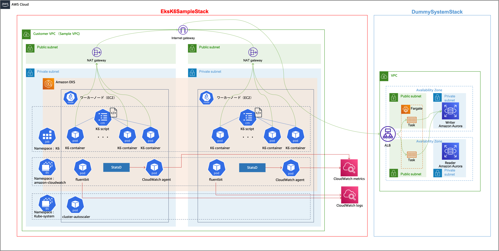
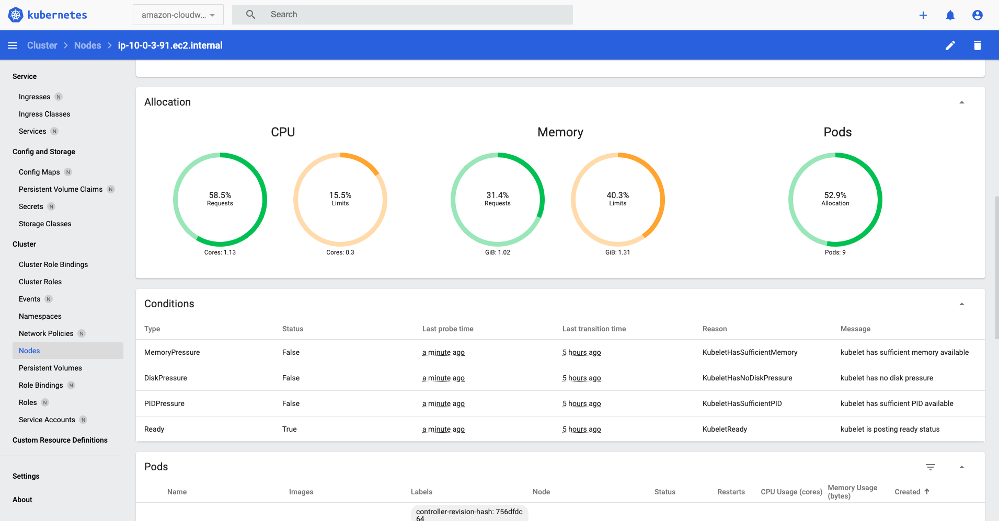
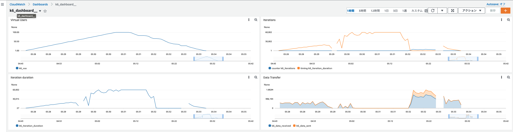

# k6負荷試験サンプルコード

※こちらはあくまでサンプルコードとなります。お客様ご自身で検証を行った上でご利用ください。\

このディレクトリは以下を含みます。

- ECS x Fargate の WordPress サイトをデプロイするスタックを定義するAWS CDKのコード
- EKS クラスター·および負荷試験に必要なIAMロール等をデプロイするスタックを定義するAWS CDKのコード
- AWS CDKによって作成されるEKS Clusterへデプロイする以下のKubernetesのリソースのマニフェストを生成するCDK8sのコード
  - k6を動作させるJob関連のリソースを定義したCDK8sのChart
  - Log, Metrics を収集する Fluentbit と CloudWatch Agent を実行する DaemonSet を定義したCDK8sのChart
  - Cluster Autoscaler関連のリソースを定義したCDK8sのChart
  - Kubernetesのダッシュボードを定義したCDK8sのChart




## ディレクトリ構成

以下は重要なファイル·ディレクトリのみ記載しています。

```shell
.
├── README.md                       # 本READMEファイル
├── bin                             # スタックの定義
├── cdk.json                        # CDKの設定ファイル
├── cdk8s.yaml                      # cdk8sの設定ファイル
├── generate-config.sh              # アカウント情報設定ファイル
├── imports                         # Kubernetes APIオブジェクト
├── jest.config.js                  # JavaScriptのフレームワークJestの設定ファイル
├── lib                             # CDK(Stack, Construct)·CDK8sの実装
│   ├── constructs                  # Constructの実装
│   ├── cluster-autoscaler-chart.ts # Cluster Autoscaler関連の実装(CDK8sのChart)
│   ├── eks-k6-sample-stack.ts      # EKS Cluster の実装
│   ├── dummy-stack.ts              # サンプルのWordPressサイトをデプロイするStackの実装
│   ├── k6-base-chart.ts            # K6の設定関連のリソース(CDK8sのChart)
│   ├── k6-job-chart.ts             # K6の実行Job関連のリソース(CDK8sのChart)
│   ├── monitoring-chart.ts         # メトリクス·ログのためのリソース定義(CDK8sのChart)
│   ├── dashboard-chart.ts          # Kubernetesのダッシュボード定義(CDK8sのChart)
│   ├── policies                    # Pod にアタッチする IAM Role の IAM Policy
│   ├── scenario                    # k6で実行したいシナリオを格納するフォルダ
│   └── config                      # CloudWatch Agentの設定
├── package-lock.json               # ライブラリ依存関係の定義ファイル
├── package.json                    # ライブラリ依存関係の定義ファイル
├── test                            # CDKのテストコード(未使用)
└── tsconfig.json                   # TypeScriptの設定ファイル
```

## デプロイ方法

上記のリソースをAWSにデプロイする方法をまとめます。

### アカウント設定の入力

以下のshellファイルを実行し、設定ファイルを生成します。

```shell
sh generate-config.sh
```

生成された`account-config.ts`の4-5行目に利用するAWSアカウントの番号·リージョンを入力します。

`account-config.ts`の8行目のarnを以下コマンドで出力されるarnに書き換えます。

```shell
aws sts get-caller-identity
```

### デプロイ実行環境の準備

デプロイを実行する端末には、下記のソフトウェアが必要です。

- AWS CLI
- Node.js 14以上
- kubectl v1.24.0
  - kubectlのversionは以下のコマンドで確認することができます。\
    `kubectl version --client --short`

なお、以下全て、シェルコマンドの初期カレントディレクトリはこの README.md が配置されたディレクトリと仮定します。

```shell
# IaCの依存関係をインストール
npm ci

# CDKをap-northeast-1リージョンで使えるように初期化する
AWS_REGION=ap-northeast-1 npx cdk bootstrap
```

一連の操作は通常1分程度で完了します。完了したら、次の手順に進んでください。

### サンプルWordPressサイトのデプロイ

以下コマンドを実行し、サンプルWordPressサイトのリソースをデプロイします。

```shell
npx cdk deploy DummySystemStack
```

このプロセスは15分ほどで終了します。ALBのDNSが出力されるため、メモしておいてください。
メモしたURLをブラウザで開きます。

WordPressの設定をするため、以下の操作を行います。

- 言語の選択画面で「日本語」を選択します。
- WordPressの設定画面で以下の項目に適当な値を入力します。
  - サイトのタイトル: サンプルサイト
  - ユーザー名: 任意のユーザー名(ex. "admin")
  - パスワード: 任意のパスワード
  - メールアドレス: 任意のメールアドレス
  - 検索エンジンでの表示にはチェックを入れます。
- 「WordPressをインストール」をクリックします
- 「ログイン」をクリックします
- 「サンプルサイトへ移動」をクリックします

### EKSのコードのデプロイ

`/lib/scenario/script.js`の12行目の<URL>を[サンプルWordPressサイトのデプロイ](###サンプルWordPressサイトのデプロイ)でメモしたDNSへ置き換えます。

以下コマンドを実行し、EKSのクラスターおよびKubernetesのリソースをデプロイします。

```shell
npx cdk deploy EksK6SampleStack
```

この操作には20分ほどかかります。デプロイが終了すると以下のOutputが出力されます。

```text
 ✅  EksK6SampleStack (no changes)

✨  Deployment time: 1.11s

Outputs:
EksK6SampleStack.EksClusterConfigCommandXXXXXX = aws eks update-kubeconfig --name EksClusterFAB68BDB-08d6b8faeaa949628d83bxxxxxxxxx --region ap-northeast-1 --role-arn arn:aws:iam::xxxxxxxxxx:role/EksK6SampleStack-iam
EksK6SampleStack.EksClusterGetTokenCommandXXXXXX = aws eks get-token --cluster-name EksClusterFAB68BDB-08d6b8faeaa949628d83bb94b6d1c5f7 --region ap-northeast-1 --role-arn arn:aws:iam::xxxxxxxxxx:role/EksK6SampleStack-iam
Stack ARN:
arn:aws:cloudformation:ap-northeast-1:xxxxxxxxxx:stack/EksK6SampleStack/f73006e0-8bfd-11ed-afa3-0e0a31xxxxx
```

まず、Outputsの1つ目に記載されているコマンドを実行してください。

デプロイしたEKSクラスターを操作できるようにkubectlの設定が変更されます。

```shell
aws eks update-kubeconfig --name EksClusterFAB68BDB-08d6b8faeaa949628d83bxxxxxxxxx --region ap-northeast-1 --role-arn arn:aws:iam::xxxxxxxxxx:role/EksK6SampleStack-iam
```

※コマンドが失敗した場合

既存のkubectlの設定と競合している場合があります。
その場合、以下のコマンドで既存の設定ファイルのバックアップを取り、既存の設定ファイルを削除した後に再度上記コマンドを実行します。

```shell
cp ~/.kube/config ~/.kube/config_backup
rm ~/.kube/config
```

次に、Outputsの2つ目に記載されているコマンドを実行してください。
先ほどデプロイしたEKSクラスターを操作する権限が適切に使用できるか確認を行います。

```shell
aws eks get-token --cluster-name EksClusterFAB68BDB-08d6b8faeaa949628d83bb94b6d1c5f7 --region ap-northeast-1 --role-arn arn:aws:iam::xxxxxxxxxx:role/EksK6SampleStack-iam
```

もしk6のJobを実行したい場合、以下のコマンドを実行します。

```shell
npx cdk deploy EksK6SampleStack -c k6=true -c parallelism=1
```

AWS CDKでは[ランタイムコンテキスト](https://docs.aws.amazon.com/ja_jp/cdk/v2/guide/context.html)を利用することができます。

- `k6`: Jobを実行するか否か("true")
- `parrallelism`: Jobの並列数(number)

`k6`が`true`にセットされ、Jobの並列数が入力された場合のみJobが実行されます。

### デプロイされたリソースの確認

#### Jobの実行確認

k6を実行するJobを確認します。以下のコマンドでpodの状態を確認してください。

```shell
kubectl get pod -n k6
```

以下のような出力が確認できたら成功です。

```text
NAME                         READY   STATUS      RESTARTS   AGE
cdk8s-k6job-c81bf89b-268b4   0/1     Completed   0          39m
```

以下のコマンドでPodのlogを確認することができます。

```shell
kubectl logs <kubectl get podで出力されたPod名> -n k6

```

#### CloudWatch Agent, Fluentbit

`lib/monitoring-chart.ts`でCloudWatch Agent, FluentbitをDaemonSetとして起動する定義しています。CloudWatch AgentはStatsDプロトコルを使用してK6から生成されるメトリクスを取得しています。

#### Kubernetes Dashboardへのアクセス

Kubernetes Dashboard ではクラスター内のリソースとその状況を一元的に確認することが可能となります。

以下のコマンドを入力して、kubernetesのダッシュボードログイン用のトークンを生成します。

```shell
kubectl -n kubernetes-dashboard create token admin-user
```

以下のコマンドを入力してダッシュボードへアクセスします。

```shell
kubectl proxy
```

上記のコマンドが成功すると、以下のURLからダッシュボードにアクセスすることができます。

[http://localhost:8001/api/v1/namespaces/kubernetes-dashboard/services/https:kubernetes-dashboard:/proxy/](http://localhost:8001/api/v1/namespaces/kubernetes-dashboard/services/https:kubernetes-dashboard:/proxy/)

本サンプルコードで作成したユーザーには管理者権限が与えられているため、検証目的でのみご利用ください。

参考ドキュメント

- [Kubernetes - Web UI (Dashboard)](https://kubernetes.io/ja/docs/tasks/access-application-cluster/web-ui-dashboard/)




#### CloudWatch Dashboard

CloudWatch DashboardでK6の実行結果を確認することが可能です。
`cloudwatch-metrics-dashboard/dashboard.json` 内の region を所望のものに変更していただきます。
AWS ConsoleからCloudWatch開き、ダッシュボードを選択します。
"Action -> View/Edit source"からテンプレートをペーストすることでダッシュボードを作成できます。





## Clean up

デプロイされたAWSリソースが不要になった場合、下記のコマンドですべて削除することができます。

```shell
npx cdk destroy --force
```

## 補足

### cdk8sで生成するyamlファイルを確認したい場合
  - 以下コマンドを実行してください。`/eks-k6-sample/dist/`以下で生成されたyamlが確認できます。 \
    `npm run cdk8s-build`

### CDK CDK8sのテストに関して

  - 本プロジェクトではテストの実施はしていませんが、実際の運用では下記リンクを参考にテストの実施を推奨します。
  - 参考ドキュメント
    - [CDKのテストに関する公式ドキュメント](https://docs.aws.amazon.com/cdk/v2/guide/testing.html)
    - [CDK8sのテストに関する公式ドキュメント](https://docs.aws.amazon.com/cdk/v2/guide/testing.html)
    - [CDK8sのテストのサンプルコード](https://github.com/cdk8s-team/cdk8s/blob/master/examples/typescript/cdk8s-plus-elasticsearch-query/main.test.ts)

### EKS Blueprintsについて

  - 本プロジェクトの趣旨はCDK8sのExampleを作成することのため、EKS Blueprintsは使用しませんでした。EKS BlueprintsによってEKS Clusterを楽に管理する方法もございますので是非こちらも参照ください。
  - 参考ドキュメント
    - [Amazon EKS Blueprints for CDK](https://github.com/aws-quickstart/cdk-eks-blueprints)
    - [Amazon EKS Blueprints for Terraform](https://github.com/aws-ia/terraform-aws-eks-blueprints)